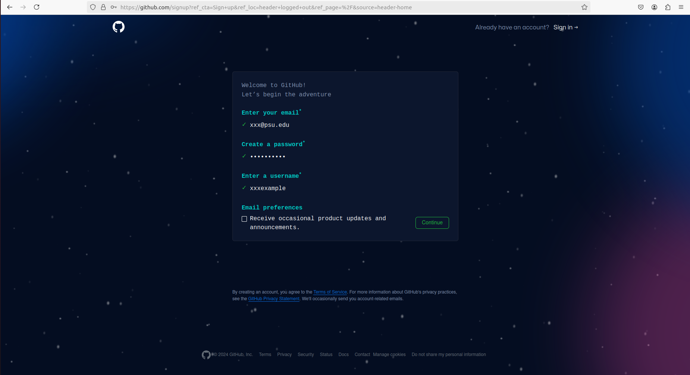
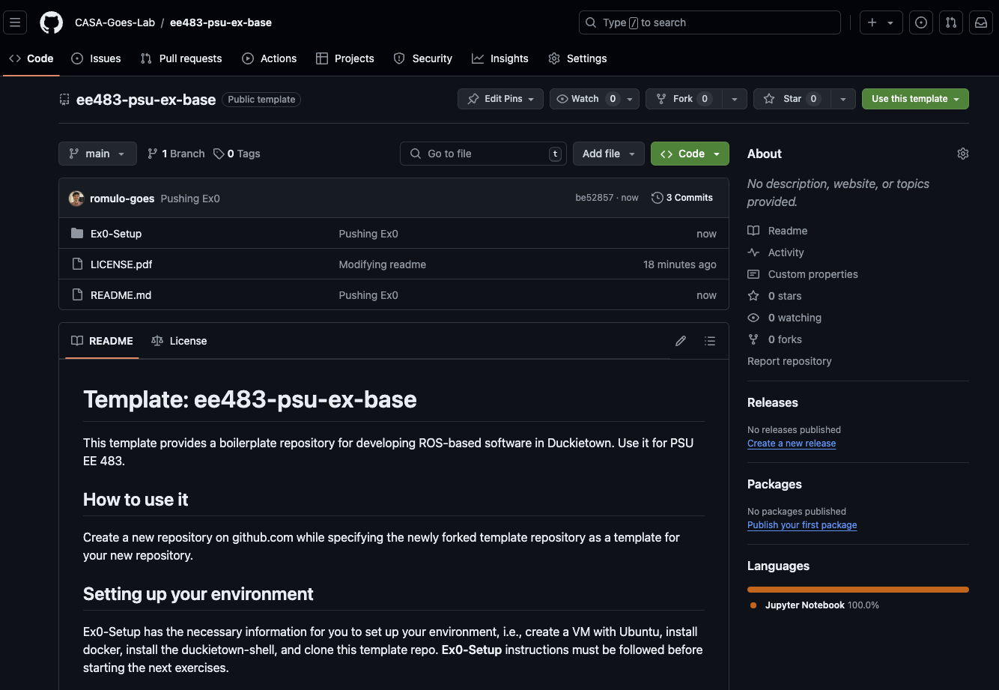
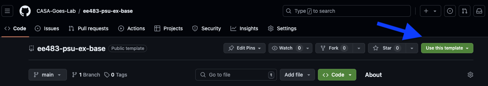
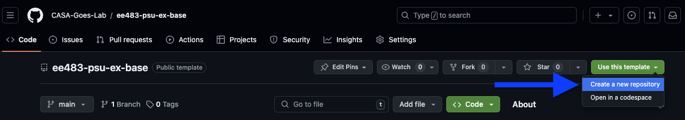
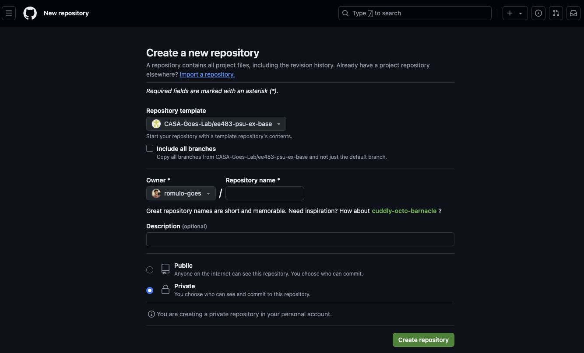

# Github Setup

Your git repository will be where you manage your files and submit homeworks/labs for this class.

- In this setup, it will cover:
  1. Create a github account
  2. Fork class repository template to your github
  3. Share repository with instructor

- We will cover in a later section how to clone your git repository to your personal computer/VM so you can make changes to your repository
---

## 1. Create a github account

- **Note:** If you already have a github account, you can skip to step 2
- Go to github.com

- Select sign up

---

- Enter your school email address
- Choose a password you can remember
- Create a username
- Hit continue and follow instructions
- Now you have a github account!

 ---

## 2. Clone class repository template and set up template

- Go to the class repository template - https://github.com/CASA-Goes-Lab/ee483-psu-ex-base

--Something like the image above. The files in the image might differ a bit from the current repo.

- Copy repo template

  

  

- Create your repository name as `<your_username>/your_name-ee483`
  - **Important:** Only use lowercase letters, numbers, and dashes when creating the name
	- No spaces or special characters like &,#,etc
- Select the private repository option

  

---

## 3. Share repository with instructor

- Share your repo with Instructor, TA, and LA
	- Seetings-> Collaborators->Add People - romulo-goes, AdamDony, CollinRoss21 

