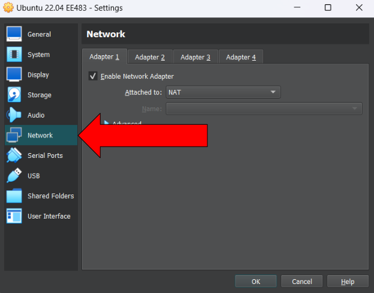

# Setup For Ubuntu 22.04 on Windows 11

    

- For our VM(virtual machine), we need a program to host our Ubuntu system. There are plenty of options out there but we will be using VirtualBox because it is free of use.
- These instructions will go over how to setup VirtualBox and create an Ubuntu machine inside of VirtualBox
- Minimum requirements

  - RAM: 4 GB
  - Storage: 40 GB free
  - CPU: 2 cores
- In this setup, it will cover:
  - VirtualBox Setup
    1. Download and install VirtualBox
  - Ubuntu Setup
    1. Download the Ubuntu 22.04.4 LTS desktop image
    2. Create a new machine in VirtualBox
    3. Add copy and paste
    4. How to power off the VM
    5. How to change the settings of the VM
    6. Switch to Bridged Network Adapter
    7. Install VScode(Visual Studio Code) on your VM
    

    

     
    

---
## VirtualBox Setup
### 1. Download and install VirtualBox 
- https://www.virtualbox.org/wiki/Downloads

- Click on windows hosts and it will start the .exe download
- Run the file once it has finished downloading

---

- Click Next

---

- Click Next

---

- Click Yes

---

- Click Yes

---

- Click Next

---

- Click Install
- Click Finish after installing and run VirtualBox

---

## Ubuntu Setup
### 1. Download the Ubuntu 22.04.4 LTS desktop image 
- https://releases.ubuntu.com/22.04/?_ga=2.149898549.2084151835.1707729318-1126754318.1683186906

- It should be ~5 GB so it will take a while to download

---

### 2. Create a new machine in VirtualBox

- Select the New option on the top toolbar

---

- Name: Create the name of the system. This can be anything you want it to be.
- Folder: Leave the same

---

- Select Other... for ISO Image
  - Go to the file location you saved the ISO Image from the Ubuntu website and select it
  - Should be called ubuntu-22.04.4-desktop-amd64.iso

---

- Leave the Skip Unattended Installation unchecked and click Next

---

- Change Username and Password. Make sure you can remember the password since it will be needed to log onto your VM

---

- Change hostname and domain name to what you desire. It cannot have spaces
- **Important:** `Check the Guest Additions ISO box to add it to your system. This provides a lot of functionality that will improve your experience`
- Click Next

---

- For base memory, 2GB is the minimum requirement for Ubuntu. However, if your system has lots of memory, use around 4 GB. Make sure the sliders stay in the green.
- For CPU, 1 core will work but if you have more than 4 cores use 2

---

- Click Next

---

- Use the Create a Virtual Hard Disk Now option. For this class, it is needed to have at least 30 GB of storage. When you create a virtual hard disk, it will not immediately take up storage, but instead set a maximum amount of storage your VM can use. So setting the max to be 50 GB is optimal.

---

- Click Next

---

- Click Finish and your machine should start
- Once it has fully booted, select 'try  or install ubuntu' in the bios if it does not automatically select it
- It will now go through the installation, do not touch anything until the sign in pops up
- Log into Ubuntu

---

- Select Skip

---

- Select Next

---

- Select if you want to send system info then hit Next

---

- Select Next
- Select Done

----

### 3. Adding copy and paste

- Select the machine button on the top toolbar

---

- Select the Advanced tab

---

- Change both the Shared Clipboard and Drag’n’Drop to Bidirectional

---

- Bidirectional allows copy and pasting across the VM and your Windows machine

---

### 4. How to power off the VM
- Select the 'X' in the top right of the VM as if you were closing a window

- Most of the time you will use the option Power off the machine
- If you want to save the machine state, meaning it will turn back on again exactly how it was when you turned it off, use the Save the machine state option

---

### 5. Changing the settings of the VM

- If you ever need to change the settings of the VM, go to VirtualBox when the machine is off and click settings. You can change parameters such as RAM, CPU cores, video memory, etc.

---
May want to move this section to when we start connecting with the duckiebots

### 6. Switch to Bridged Network Adapter
- In order to connect to your duckiebot, you will need to use the Bridged Adapter setting in VirtualBox

- Open settings as show in step 5 and click on Network

---

- Select Bridged Adapter then click OK
- Now you should not have any problems connecting to your duckiebot using the network

---

### 7. Install VScode(Visual Studio Code) on your VM

- Select the Ubuntu Software Application on the left taskbar. It looks like an orange suitcase

---

- Select the search icon

---

- Search visual studio
- Select the code application. This is VScode but they call it code in Ubuntu

---

- Hit Install
- Put log in password in for authentication
- It should now install

---

- To run VScode (and terminal when you need to), select Show Applications on the bottom left, search the application you want, and click on the icon to start it

