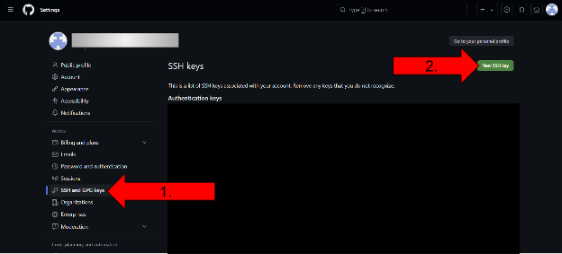

<div style="text-align: center;">

# Cloning Git Repository
</div>


<div style="display: flex;">
    <div style="flex: 50%; padding: 10px;">

In this setup, we will cover how to clone your git repository so that you can edit your code

- When you clone your repository you will create a local version that only exists on your computer

- In your first assignment you will learn how to update GitHub with your local changes

The layout of this setup is:
1. Setting SSH key
2. Cloning repository
3. Modifying Docker file

    </div>
    <div style="flex: 50%; padding: 10px;">
     
    </div>
</div>

---

## 1. Setting SSH key
- To be able to clone your repository, you will need an ssh key to authenticate access, similar to the previous access tokens we have setup.
    - ssh key is a pair of cryptographic keys used for secure access and authentication

- Open a terminal in your VM and run the follwoing code to generate an ssh on your computer:

```bash
ssh-keygen
```

- ssh keys have a public and private pair of keys. We want the public key. To get the public key, use the following code:

```bash
cat ~/.ssh/id_rsa.pub
```

- Copy this public key

- Now we want to tell GitHub what this key is. Go to https://github.com/
    - Select your icon in the top right and select settings under the dropdown



1. Go to the SSH and GPG keys tab
2. Select New SSH key

---


1. Add a title related to the device you are working on such as "Personal Computer"
2. Paste the SSH public key that you copied from before
3. Select Add SSH key
4. In your terminal, test the ssh key running the following command. It might ask for your ssh key passphrase if you added one. If it ran successfully, it shows a message "Hi \<username\>! You've ..." 
    
```bash
ssh git@github.com 
```

---

- Navigate to your repository for this class on https://github.com/


1. Select the green Code dropdown button
2. Select SSH
3. Copy the code

---

## 2. Cloning repository

- Use the code below along with what you just copied to clone your repository. In a VM terminal, go to a desired location where you want to copy your repo, e.g., `cd ~` copies to your home directory.

```bash
git clone git@github.com:<your_username>/yourreponame-ee483
```

- Replace REPO_URL with the GitHub SSH clone URL you just copied
- This will create a clone of your repo in whatever folder you are currently in for your terminal

- Now you need to set your git name and email address for your system:

```bash
git config --global user.name "YOUR_NAME"
git config --global user.email "YOUR_EMAIL"
```

- Replace YOUR_NAME and YOUR_EMAIL with the name of your GitHub account and email used for your GitHub account. Leave the quotes

- Next, list the current remote repository for your fork, Specify a new remote upstream repo, comfirm that new upstream was added to the list

```bash
git remote -v
git remote add upstream https://github.com/CASA-Goes-Lab/ee483-psu-ex-base
git remote -v
```

- It should show taht the psu-ex-base is the `upstream` while your repo is the `origin`
- For every new exercise pull the upstream (Similar steps for the lab repo later on)
- We will cover that later
---

## 3. Modifying Dockerfile

- As a little exercise to learn how to upload local changes, we will modify the dockerfile in EX1

- Navigate to the ex1-recipe in your repository by using the terminal and the `cd` command:

```bash
gedit Dockerfile
```

- Edit line 4 in the Dockerfile to the name of your repo, description of the repository, and maintainer using your name and GitHub username

\# syntax=docker/dockerfile:1.4

\# parameters

ARG EXERCISE_NAME=`"ex1"` <--

ARG DESCRIPTION=`"Exercise"` <--

ARG MAINTAINER=`"YOUR NAME"` <--

- Save the file

- Use the following code to see the changes we made:

```bash
git status
```

- You should see that the Dockerfile has been changed

- Now we need to add this file to the next commit:
    - A commit is a snapshot of changes made to the codebase. Sort of like a record of the changes made

```bash
git add -A
```

- Now we need to run the commit. Adding a message with the command `-m` helps keep track of changes as you go

```bash
git commit -m "updated dockerfile"
```

- Next step is to push the commit to GitHub using the following command:

```bash
git push
```

- Check on the Github.com that the dockerfile has been updated.
- Last step is to test the git tag

```bash 
git tag ex0
git push origin ex0
```
- Verify on GitHub.com that your submission is there, in the correct tag.

- Now you are setup to complete the assignments on your computer!

---

## 4. Visual Studio Code

- Open Visual Studio Code (You might need to install it) - https://code.visualstudio.com/

- Go in `File->Open Folder...` and select your repo folder. If you have cloned it to `~`, it should be `~/ee483-psu-ex-<yourname>`
- Next save this as a `Workspace`, `File->Save Workspace As` in your repo folder
- In Visual Studio Code you can open terminals by going in `Terminal->New Terminal` or `Ctrl+Shift+\` `
- Use the VSCode environment to develop your homework. On the left of it, you will see all the folders in your repo.
- For example in `Ex0-Setup`, all instructions we have followed so far are available as Markdown (.md) files or Jupyter Notebook (.ipynb) files - 01_github_setup, 02_pc_setup, 03_ubuntu_windows, 04_clone_repository.
- Your next task is to follow the instructions in `05_duckietown_docker_setup.ipynb`
- Open that file, and follow the instructions there about installing the necessary software for this class.

